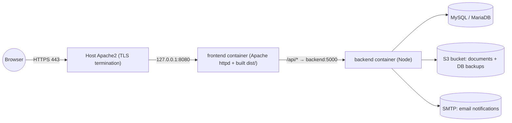

# AWS Deployment Guide

Step-by-step instructions for running this application on a live AWS instance. This complements
[LAUNCH_READINESS_CHECKLIST.md](LAUNCH_READINESS_CHECKLIST.md) — read that first if this is a **real**
production launch (real users/client data), since several security items there (MFA, secrets rotation,
TLS enforcement, Data Protection Act review) are not covered by this guide and are still open.

## 1. Architecture

Single EC2 instance running Docker Compose (recommended — [§5](#5-docker-compose-deployment-recommended))
or a manual PM2 + Apache2 setup ([appendix](#appendix-manual-deployment-without-docker)), in front of either
a local MariaDB container or a separate Amazon RDS instance. Either way, a thin host-level Apache2 handles
TLS termination and is the only thing exposed to the internet.



Only ports **80** and **443** are exposed publicly. The frontend container's port (8080), the backend
(5000), and the database (3306) all stay bound to `localhost`/the security group's internal traffic only.

## 2. Prerequisites

- An AWS account with permission to create EC2 instances, security groups, and (optionally) RDS/S3.
- A domain name you control, if you want a real hostname + TLS certificate (recommended).
- The repo pushed to a Git remote you can `git clone` from the instance (GitHub, CodeCommit, etc.).
- Rotated production secrets ready to go (JWT secret, DB password, AWS keys, SMTP password) — do **not**
  reuse whatever is currently sitting in `backend/.env` in this repo; see §1 of the launch checklist.

## 3. Launch the EC2 instance

1. **AMI**: Ubuntu Server 22.04 LTS (or 24.04 LTS), x86_64.
2. **Instance type**: `t3.small` (2 vCPU / 2 GB) is a reasonable starting point for a pilot; go to
   `t3.medium` or larger if you expect real concurrent load (the spec targets 100 concurrent users).
3. **Storage**: 20–30 GB gp3 EBS volume is enough unless you're also hosting the database and lots of
   uploaded documents locally.
4. **Key pair**: create/download one for SSH access.
5. **Security group** — inbound rules:

   | Port | Protocol | Source                          | Purpose                      |
   |------|----------|----------------------------------|-------------------------------|
   | 22   | TCP      | your admin IP only (not 0.0.0.0/0) | SSH                          |
   | 80   | TCP      | 0.0.0.0/0                        | HTTP (redirects to HTTPS)     |
   | 443  | TCP      | 0.0.0.0/0                        | HTTPS                          |
   | 3306 | TCP      | *do not open publicly*           | only if using RDS from elsewhere in the same VPC |

   Leave 5000 (backend) and any Vite ports closed to the internet entirely — Apache2 is the only public
   entry point.
6. **Elastic IP**: allocate and associate one, so the public IP doesn't change on reboot. Point your
   domain's DNS `A` record at it.

## 4. Connect and install Docker

```bash
ssh -i your-key.pem ubuntu@<elastic-ip>

sudo apt update && sudo apt upgrade -y
sudo apt install -y docker.io docker-compose-plugin git apache2 certbot python3-certbot-apache
sudo usermod -aG docker ubuntu   # log out/in for this to take effect

docker --version && docker compose version
```

## 5. Docker Compose deployment (recommended)

The repo's [docker-compose.yml](docker-compose.yml) builds and runs all three pieces — MariaDB, the
backend API ([backend/Dockerfile](backend/Dockerfile)), and the frontend, served by an internal Apache
httpd from a production build ([frontend/Dockerfile](frontend/Dockerfile), [frontend/apache.conf](frontend/apache.conf))
— as one stack.

### 5.1 Clone the repo and configure secrets

```bash
cd /opt   # or wherever you want the app to live
sudo git clone <your-repo-url> planetone
sudo chown -R ubuntu:ubuntu planetone
cd planetone
cp .env.example .env
nano .env
```

Set real, rotated values (never commit these, and never reuse whatever is currently in this repo's
`.env.example` history — see §1 of the launch checklist) — the backend reads:

| Variable | Purpose |
|---|---|
| `DATABASE_URL` | ignored in the Docker path — `docker-compose.yml` overrides it to point at the `db` service, see below |
| `JWT_SECRET` | long random string, unique to this environment |
| `AWS_ACCESS_KEY_ID` / `AWS_SECRET_ACCESS_KEY` | for document uploads + optional DB backup upload |
| `AWS_STORAGE_BUCKET_NAME`, `AWS_S3_REGION_NAME` | S3 bucket for documents/backups |
| `EMAIL_HOST`, `EMAIL_PORT`, `EMAIL_USE_TLS`/`EMAIL_USE_SSL`, `EMAIL_HOST_USER`, `EMAIL_HOST_PASSWORD`, `DEFAULT_FROM_EMAIL` | SMTP for email notifications (`backend/services/emailService.js`) |
| `DB_BACKUP_DIR`, `DB_BACKUP_S3_PREFIX`, `DB_BACKUP_RETENTION_COUNT` | optional overrides for the automated backup schedule (`backend/services/backupService.js`) |

Also add a real MariaDB root password to the same `.env` (docker-compose automatically loads `.env` from
the same directory as the compose file, i.e. the repo root):

```bash
cd /opt/planetone
echo "DB_ROOT_PASSWORD=$(openssl rand -base64 24)" >> .env
```

(`docker-compose.yml` falls back to a dev default, `Yash1234`, only if `DB_ROOT_PASSWORD` isn't set — do
not rely on that default for anything real.)

### 5.2 Build and start the stack

```bash
cd /opt/planetone
npm run docker:up
# equivalent to: docker compose up -d --build
```

This builds the backend and frontend images, then starts `db` (MariaDB), `backend` (Node API on
`127.0.0.1:5000`), and `frontend` (Apache httpd serving the built app on `127.0.0.1:8080`) — the backend
waits for the database's healthcheck before it starts, via `depends_on: condition: service_healthy`.

### 5.3 Run migrations

```bash
npm run docker:migrate
# equivalent to: docker compose exec backend npm run migrate
```

Optional, only for a fresh demo environment — do **not** run against a real client's data:

```bash
docker compose exec backend npm run seed:demo
docker compose exec backend npm run seed:blocks
```

Useful day-to-day commands: `npm run docker:logs` (tail all container logs), `docker compose ps`,
`docker compose restart backend`, `npm run docker:down` (stop everything, keeps volumes/data).

## 6. Put Apache2 + TLS in front of the Docker stack

The frontend container already proxies `/api/*` to the backend internally, so the host Apache2 just needs
to forward everything to `127.0.0.1:8080` and handle TLS.

Enable the required modules:

```bash
sudo a2enmod proxy proxy_http ssl
```

Create `/etc/apache2/sites-available/planetone.conf`:

```apache
<VirtualHost *:80>
    ServerName your-domain.com

    ProxyPreserveHost On
    ProxyPass / http://127.0.0.1:8080/
    ProxyPassReverse / http://127.0.0.1:8080/
</VirtualHost>
```

```bash
sudo a2ensite planetone
sudo a2dissite 000-default
sudo apachectl configtest && sudo systemctl reload apache2

# TLS via Let's Encrypt — edits the config above to add the `<VirtualHost *:443>` block + auto-renewal
sudo certbot --apache -d your-domain.com
sudo certbot renew --dry-run   # verify auto-renewal works
```

## 7. Verify

```bash
curl http://127.0.0.1:8080/api/health   # {"status":"ok"} — straight to the frontend container
curl https://your-domain.com/api/health # from your own machine, through host Apache2 + TLS
```

Then open `https://your-domain.com` in a browser and confirm login works end-to-end.

## 8. Deploying updates later

```bash
cd /opt/planetone
git pull
docker compose exec backend npm run migrate
docker compose up -d --build   # rebuilds only images whose source changed
```

## 9. Before calling this a real production launch

This guide gets the app **running** on AWS; it does not by itself make it production-secure. Go through
[LAUNCH_READINESS_CHECKLIST.md](LAUNCH_READINESS_CHECKLIST.md) §1 (Security & Compliance) before onboarding
real users/client data — in particular: rotate every secret away from what's ever been committed to this
repo's git history (see §1's "Secrets hygiene" note), enforce TLS (done above), add MFA for privileged
roles, and review Ghana Data Protection Act (Act 843) compliance.

## Appendix: Manual deployment (without Docker)

If you'd rather not use Docker for the app itself (e.g. only using it for the database, or not at all),
run the backend directly with PM2 and serve the frontend build as static files from Apache2.

### A.1 Install Node.js and PM2

```bash
curl -fsSL https://deb.nodesource.com/setup_20.x | sudo -E bash -
sudo apt install -y nodejs
sudo npm install -g pm2
```

### A.2 Database

**Amazon RDS for MySQL** (recommended for a real production launch) — create a MySQL 8.0 RDS instance in
the same VPC and use its endpoint in `DATABASE_URL` below; gives you managed backups/failover instead of
relying solely on the app's own backup service.

**Or** run just the `db` service from [docker-compose.yml](docker-compose.yml) (`docker compose up -d db`)
and point `DATABASE_URL` at `localhost:3306`.

### A.3 Clone the repo and configure the backend

Same as [§5.1](#51-clone-the-repo-and-configure-secrets) above, except `DATABASE_URL` is used directly
(not overridden), e.g. `mysql://<user>:<password>@<host>:3306/PlanetOneDashboard`, and `PORT=5000`.

### A.4 Install dependencies, migrate, and build

```bash
cd /opt/planetone
npm run install:clean       # clean install — see §6 of the launch checklist
cd backend && npm run migrate && cd ..
cd frontend && npm run build && cd ..   # produces frontend/dist/, served by Apache2 below
```

### A.5 Configure Apache2 to serve `frontend/dist` and proxy `/api`

```bash
sudo a2enmod proxy proxy_http rewrite ssl
```

Create `/etc/apache2/sites-available/planetone.conf`:

```apache
<VirtualHost *:80>
    ServerName your-domain.com

    DocumentRoot /opt/planetone/frontend/dist

    ProxyPreserveHost On
    ProxyPass /api http://127.0.0.1:5000/api
    ProxyPassReverse /api http://127.0.0.1:5000/api

    <Directory /opt/planetone/frontend/dist>
        Options -Indexes +FollowSymLinks
        AllowOverride None
        Require all granted

        RewriteEngine On
        # Client-side (React Router) — serve index.html for any non-file, non-directory request
        # that isn't already being handled by the /api proxy above.
        RewriteCond %{REQUEST_URI} !^/api
        RewriteCond %{REQUEST_FILENAME} !-f
        RewriteCond %{REQUEST_FILENAME} !-d
        RewriteRule ^ /index.html [L]
    </Directory>
</VirtualHost>
```

Enable it and add TLS the same way as [§6](#6-put-apache2--tls-in-front-of-the-docker-stack) above
(`a2ensite planetone`, `a2dissite 000-default`, `apachectl configtest`, `systemctl reload apache2`, then
`certbot --apache -d your-domain.com`).

### A.6 Start the backend with PM2

```bash
cd /opt/planetone
pm2 start ecosystem.config.js --only planetone-backend
pm2 save
pm2 startup systemd -u ubuntu --hp /home/ubuntu
# run the command pm2 startup prints, to survive a reboot
```

Shortcuts in the root `package.json`: `npm run pm2:start`, `pm2:status`, `pm2:logs`, `pm2:restart`.

### A.7 Deploying updates later

```bash
cd /opt/planetone
git pull
npm run install:clean
cd backend && npm run migrate && cd ..
cd frontend && npm run build && cd ..
pm2 restart planetone-backend
sudo systemctl reload apache2  # only needed if the Apache2 config itself changed
```
