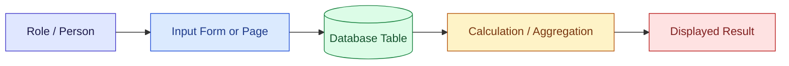
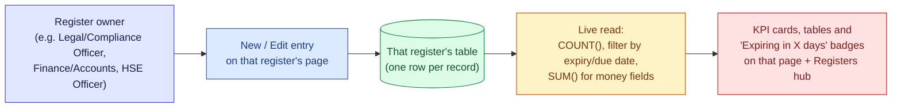
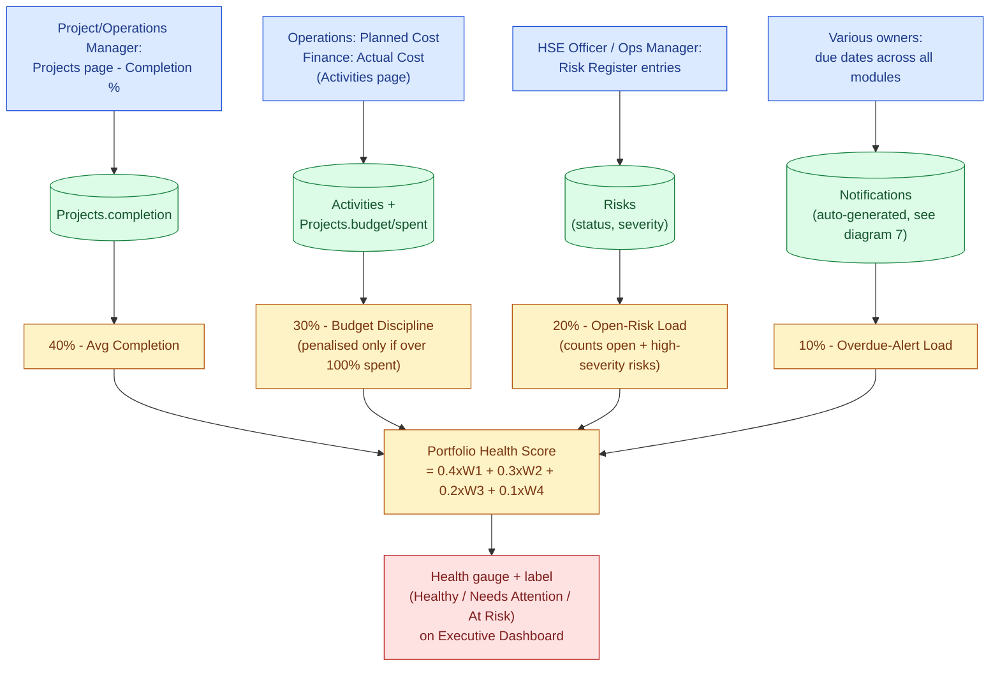
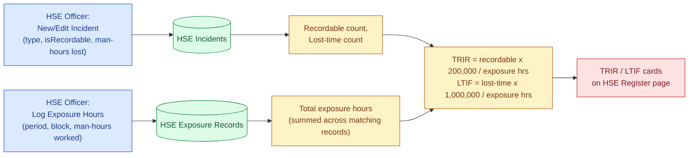
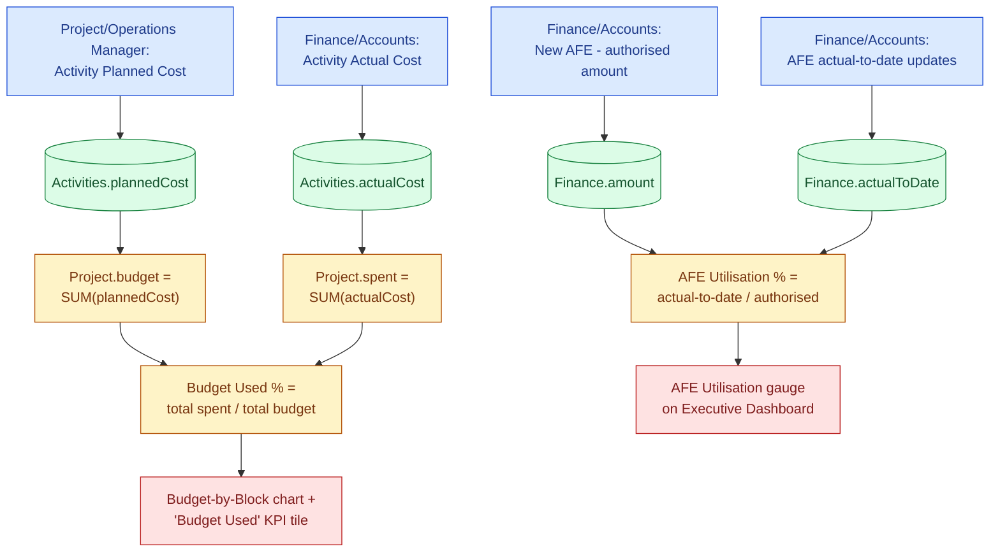
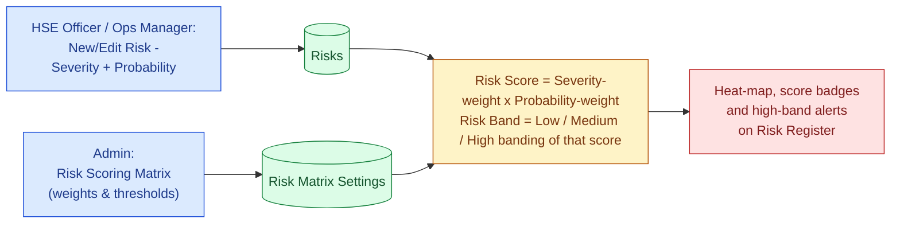
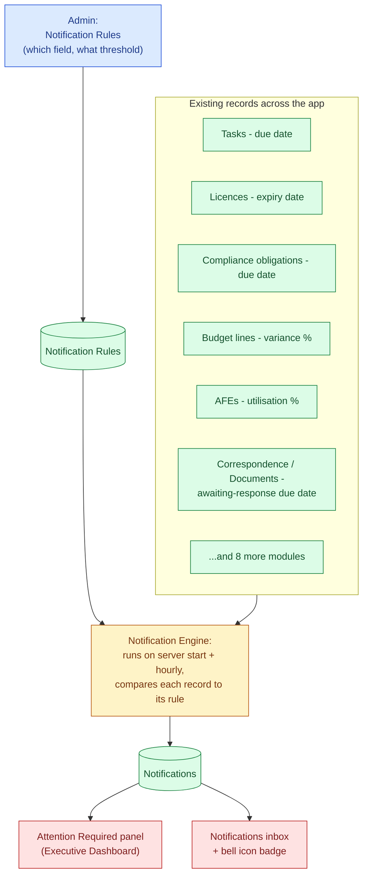
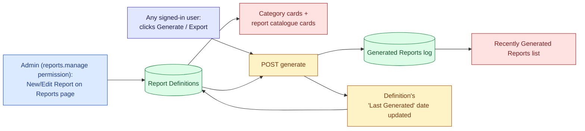

# Data Flow Diagram — PlanetOne Oil & Gas Project Tracking Application

This document visually explains **how the data your team enters ends up as the numbers, charts and scores you see on the dashboards** — so it's clear what's "real" (backed by someone's input) versus calculated, and who to talk to if a number looks wrong.

> For a detailed field-by-field table (exact page, exact field, exact responsible role), see [Section 13 of the USER_GUIDE.md](USER_GUIDE.md#13-where-the-numbers-come-from--data-sources--ownership). This document is the visual companion to that table.

---

## How to read these diagrams

Every diagram below uses the same 5-stage flow and colour coding:

| Colour | Stage | Meaning |
| --- | --- | --- |
| 🟣 Purple | **Role / Person** | Who is responsible for the input |
| 🔵 Blue | **Input Form / Page** | The exact page/dialog where they type it in |
| 🟢 Green (cylinder) | **Database Table** | Where it's permanently stored |
| 🟡 Amber | **Calculation / Aggregation** | Backend logic that combines/derives a number |
| 🔴 Red | **Displayed Result** | The widget/KPI/chart you actually see in the app |

---

## 1. Master Data Flow (High-Level)

The big picture: every number in the app traces back to a real person entering data on a real page — nothing is hardcoded.

```mermaid
flowchart TD
    subgraph ROLES["Who enters data"]
        R1["Project / Operations Manager"]:::role
        R2["Finance / Accounts"]:::role
        R3["HSE Officer"]:::role
        R4["Legal / Compliance Officer"]:::role
        R5["Admin"]:::role
    end

    subgraph FORMS["Where they enter it"]
        F1["Activities page:<br/>Planned Cost, Status"]:::form
        F2["Activities page:<br/>Actual Cost"]:::form
        F3["Projects page:<br/>New / Edit Project"]:::form
        F4["HSE Register:<br/>Incidents + Exposure Hours"]:::form
        F5["Risk Register:<br/>Severity, Probability"]:::form
        F6["Governance registers:<br/>Contracts, Compliance, Insurance,<br/>Env. Permits, NDA, Correspondence..."]:::form
        F7["Budget Tracker / Finance:<br/>AFE and budget line amounts"]:::form
        F8["Admin panel:<br/>Risk Matrix, RBAC, Report Catalogue"]:::form
    end

    subgraph DB["What gets stored"]
        D1[("Activities")]:::db
        D2[("Projects")]:::db
        D3[("HSE Incidents +<br/>Exposure Hours")]:::db
        D4[("Risks")]:::db
        D5[("Governance register tables")]:::db
        D6[("Finance / Budget Lines")]:::db
        D7[("RBAC + Report Definitions")]:::db
    end

    subgraph CALC["How it's calculated"]
        C1["Project budget/spent =<br/>SUM of linked Activity costs"]:::calc
        C2["Portfolio Health Score =<br/>weighted composite"]:::calc
        C3["TRIR / LTIF formulas"]:::calc
        C4["Risk Score =<br/>Severity x Probability x Matrix"]:::calc
        C5["Notification Engine:<br/>due-date & threshold sweep"]:::calc
        C6["Register counts =<br/>live COUNT() per table"]:::calc
    end

    subgraph DISPLAY["What you see"]
        V1["Executive Dashboard:<br/>Portfolio Health, KPI strip,<br/>Asset Health Matrix"]:::display
        V2["HSE Register:<br/>TRIR / LTIF cards"]:::display
        V3["Risk Register:<br/>heat-map & score badges"]:::display
        V4["Attention Required panel +<br/>Notifications inbox"]:::display
        V5["Registers hub:<br/>live entry counts"]:::display
        V6["Reports page:<br/>catalogue + Recently Generated"]:::display
    end

    R1 --> F1 & F3
    R2 --> F2 & F7
    R3 --> F4
    R4 --> F6
    R5 --> F8

    F1 --> D1
    F2 --> D1
    F3 --> D2
    F4 --> D3
    F5 --> D4
    F6 --> D5
    F7 --> D6
    F8 --> D7

    D1 --> C1 --> D2
    D2 --> C2
    D4 --> C4 --> D4
    D3 --> C3
    D5 --> C5
    D6 --> C5
    D4 --> C5
    D1 --> C5
    D5 --> C6
    D6 --> C6
    D4 --> C6
    D3 --> C6

    C2 --> V1
    C1 --> V1
    C6 --> V5
    C3 --> V2
    C4 --> V3
    C5 --> V4
    D7 --> V6

    classDef role fill:#e0e7ff,stroke:#4338ca,color:#1e1b4b,stroke-width:1px;
    classDef form fill:#dbeafe,stroke:#1d4ed8,color:#1e3a8a,stroke-width:1px;
    classDef db fill:#dcfce7,stroke:#15803d,color:#14532d,stroke-width:1px;
    classDef calc fill:#fef3c7,stroke:#b45309,color:#78350f,stroke-width:1px;
    classDef display fill:#fee2e2,stroke:#b91c1c,color:#7f1d1d,stroke-width:1px;
```

---

## 2. Generic Register Pattern

Most governance/finance registers (**Contracts, Compliance, Insurance, Environmental Permits, NDA & Data Room, Correspondence, Decisions, Vendor Payments, Forex, Local Content, Operations Updates, Licences**) follow one repeatable, simple pattern — no composite math involved:

*Whatever you type into that register's "New/Edit" form is exactly what drives its own KPI cards and its tile on the Registers hub — there's no hidden transformation.*

---

## 3. Portfolio Health Score (Executive Dashboard gauge)

The single 0–100 score on the Executive Dashboard is a **weighted composite of 4 independent inputs** — it is not typed in anywhere itself.

> ⚠️ **Good to know:** the Projects list/dashboard "Completion %" is the value typed into the project's **Completion %** field (Edit Project dialog). The **Project Detail page** additionally shows its own "Completion" statistic, calculated live from that project's Activities (`completed activities ÷ total activities`). These two numbers are independent and can differ — the detail-page figure is not automatically saved back into the field the dashboard uses.

---

## 4. HSE Safety Metrics — TRIR / LTIF

*If TRIR/LTIF show "—", it means no Exposure Hours have been logged yet for that block/filter — log them via the "Log Exposure Hours" button to activate these metrics.*

---

## 5. Budget Utilisation & AFE Utilisation

---

## 6. Risk Score & Risk Band

---

## 7. Notification & Alert Engine → "Attention Required"

This is the one flow where the **input isn't a single form** — it's the due dates and statuses already sitting on records across many modules.

*Nobody "enters" a notification directly — an alert only ever exists because a real record (a task, a licence, an AFE...) crossed a threshold that an Admin configured. Whoever owns that underlying record is responsible for resolving it.*

---

## 8. Reports Catalogue → Generate → Recently Generated

---

## Summary — who to contact if a number looks wrong

| If this looks wrong... | Talk to... |
| --- | --- |
| Portfolio Health Score, Avg Completion, Budget Used % | Project/Operations Manager (completion) or Finance/Accounts (budget/actuals) |
| AFE Utilisation | Finance/Accounts |
| Risk heat-map / Risk Score | HSE Officer or Project/Operations Manager (the risk entry) · Admin (the scoring matrix) |
| TRIR / LTIF | HSE Officer |
| Any register KPI (Contracts, Compliance, Insurance, etc.) | That register's designated owner — see [Section 12 of the USER_GUIDE.md](USER_GUIDE.md#12-roles--access-reference) |
| A notification / alert | The owner of the underlying record it references — or Admin if the rule/threshold itself seems wrong |
| Reports catalogue (categories, available reports) | Admin |

For the exact field names and permission keys behind every box in these diagrams, see [USER_GUIDE.md Section 13](USER_GUIDE.md#13-where-the-numbers-come-from--data-sources--ownership).
